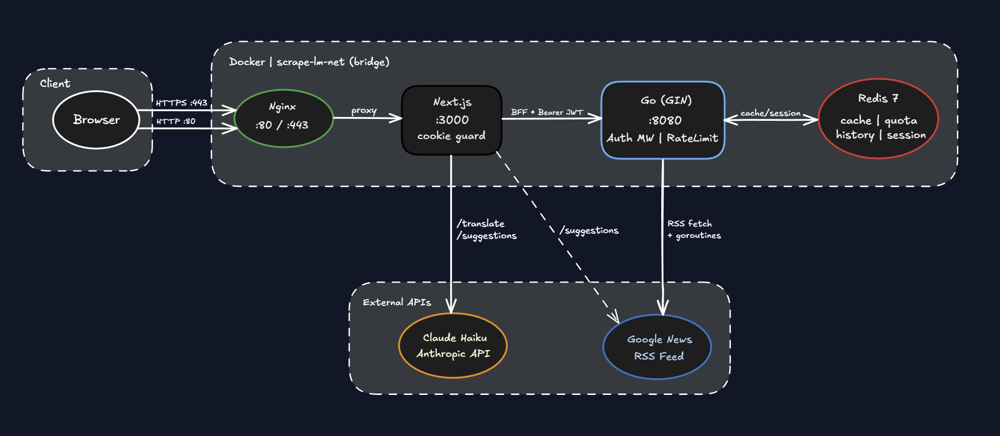
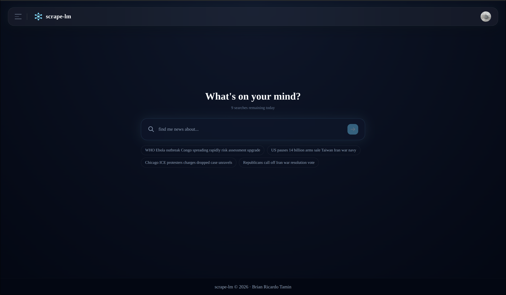
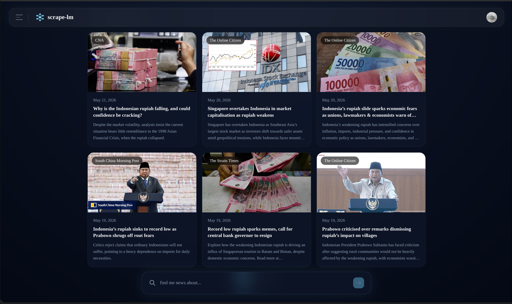

<div align="center">

<br/>


</div>

<div align="center">

<br/>


</div>

---

**Live:** [scrapelm.com](https://scrapelm.com)

---

## About

scrape-lm is an AI-powered news aggregator that accepts natural language prompts, translates them into structured search queries using the Claude API, and scrapes Google News RSS in real time. Results are cached in Redis, and each authenticated user gets a personalized quota, search history, and AI-curated prompt suggestions.

---

## Features

- **Natural Language Search**
  Type anything in plain English or any language. Claude API parses the prompt into a structured query with topic keywords, inclusion/exclusion filters, and sort preference, then forwards it to the Go backend.

- **Real-Time News Scraping**
  Fetches live articles from Google News RSS and decodes obfuscated article URLs using Google's batchexecute API. Each article is enriched with OG metadata including title, description, and cover image.

- **Redis Caching**
  Scraped results are cached for 15 minutes using a SHA-256 key derived from the topic. Subsequent queries for the same topic are served instantly from cache without hitting the scraper.

- **Per-Account Daily Quota**
  Each authenticated user gets 10 searches per day, tracked atomically in Redis and reset at midnight UTC. Cache hits do not count against the quota.

- **Search History**
  The last 20 searches per account are stored in a Redis List, reset at midnight UTC, and surfaced in the sidebar for one-click re-run.

- **AI Prompt Suggestions**
  The home screen surfaces 4 AI-curated search suggestions derived from live Google News headlines, refreshed every 5 minutes via an in-memory TTL store on the Next.js server.

- **OAuth Authentication**
  Authentication is handled by NextAuth with Google and GitHub OAuth. On login, the backend issues a signed JWT stored as an httpOnly session cookie, validated by the Go auth middleware on every protected request.

- **Paginated News Feed**
  Results are paginated at 6 cards per page, up to 5 pages (30 articles max). Filters are applied in memory after cache retrieval, so pagination never triggers a re-scrape.

---

## Tech Stack

| Layer | Technology |
|:---|:---|
| Frontend | Next.js 15 (App Router), TypeScript, Tailwind CSS |
| AI / NLP | Claude API, Haiku model (prompt translation, suggestions) |
| Backend | Go 1.24, Gin |
| Scraping | Google News RSS, net/http, batchexecute URL decoder |
| Cache | Redis 7 (news, quota, history, sessions) |
| Auth | NextAuth v5, Google OAuth 2.0, GitHub OAuth, JWT (golang-jwt) |
| Deployment | Docker, Docker Compose, Nginx |

---

## Architecture

<div align="center">
  
</div>

### Redis Key Schema

| Key Pattern | Type | TTL | Purpose |
|:---|:---|:---|:---|
| `<sha256(topic)>` | String (JSON) | 15 min | Cached news results |
| `quota:<userID>` | String (int) | until midnight UTC | Daily search count per user |
| `history:<userID>` | List | until midnight UTC | Last 20 searches per user |
| `session:<userID>` | String | 24 h | Backend JWT token |

---

## Screenshots

<div align="center">

| Home | Results | History Sidebar |
|:---:|:---:|:---:|
|  |  |  |

</div>

---

## Setup and Run

> **Prerequisites:** Docker, Docker Compose

### Clone the repository

```bash
git clone https://github.com/brii26/scrape-lm.git
cd scrape-lm
```

### Configure environment

Copy the example env files and fill in your credentials.

```bash
cp backend/.env.example backend/.env.production
cp frontend/.env.example frontend/.env.production
```

**Backend (`backend/.env.production`):**
```env
PORT=8080
APP_ENV=production
REDIS_ADDR=redis:6379
JWT_SECRET=your_jwt_secret
GOOGLE_CLIENT_ID=your_google_client_id
ALLOWED_ORIGIN=https://yourdomain.com
```

**Frontend (`frontend/.env.production`):**
```env
AUTH_SECRET=your_auth_secret
NEXTAUTH_URL=https://yourdomain.com
AUTH_TRUST_HOST=true
GOOGLE_CLIENT_ID=your_google_client_id
GOOGLE_CLIENT_SECRET=your_google_client_secret
GITHUB_CLIENT_ID=your_github_client_id
GITHUB_CLIENT_SECRET=your_github_client_secret
NEXT_PUBLIC_API_URL=http://backend:8080
ANTHROPIC_API_KEY=your_anthropic_api_key
```

### Run with Docker Compose

```bash
docker compose up -d
```

The app will be available at `https://yourdomain.com` via Nginx.

### Run locally (development)

```bash
docker compose up redis
```

```bash
cd backend && air
```

```bash
cd frontend && npm run dev
```

---

## Project Structure

```
scrape-lm/
├── backend/
│   ├── cmd/main.go                   # Entry point, Gin router wiring
│   ├── config/config.go              # Env-based config loader
│   ├── internal/
│   │   ├── auth/
│   │   │   ├── handler.go            # Google + GitHub OAuth callback handlers
│   │   │   ├── routes.go             # Auth route registration
│   │   │   └── service.go            # JWT issuance + session management
│   │   ├── cache/
│   │   │   ├── history.go            # Redis List - search history per user
│   │   │   ├── quota.go              # Redis String - daily quota per user
│   │   │   ├── redis.go              # Redis client init
│   │   │   └── session.go            # Redis String - backend JWT session
│   │   ├── middleware/
│   │   │   ├── auth.go               # JWT validation middleware
│   │   │   ├── cors.go               # CORS middleware
│   │   │   ├── logger.go             # Request logger
│   │   │   └── ratelimit.go          # Rate limiter
│   │   ├── news/
│   │   │   ├── handler.go            # Scrape endpoint handler
│   │   │   ├── routes.go             # News route registration
│   │   │   └── service.go            # Cache lookup + scrape orchestration
│   │   └── scraper/
│   │       ├── decoder.go            # batchexecute URL decoder
│   │       ├── limiter.go            # Concurrency limiter for OG fetches
│   │       ├── parser.go             # RSS + OG metadata parser
│   │       └── scraper.go            # Google News RSS entry point
│   └── pkg/
│       ├── hash/hash.go              # SHA-256 cache key generator
│       ├── response/response.go      # Unified JSON envelope
│       └── types/types.go            # Shared ScrapeQuery, NewsItem types
├── frontend/
│   ├── app/
│   │   ├── (auth)/
│   │   │   ├── layout.tsx            # Auth layout
│   │   │   └── login/
│   │   │       ├── OAuthButton.tsx   # OAuth button component
│   │   │       └── page.tsx          # Login page
│   │   ├── (main)/
│   │   │   ├── layout.tsx            # Main layout with MainShell
│   │   │   ├── page.tsx              # Home - prompt + client-side search
│   │   │   └── news/page.tsx         # News - SSR search results
│   │   └── api/
│   │       ├── auth/
│   │       │   ├── [...nextauth]/route.ts   # NextAuth handler
│   │       │   └── set-session/route.ts     # Sets httpOnly session cookie
│   │       ├── history/route.ts      # Proxy -> Go /api/history
│   │       ├── news/route.ts         # Proxy -> Go /api/scrape
│   │       ├── quota/route.ts        # Proxy -> Go /api/quota
│   │       ├── suggestions/route.ts  # Claude API suggestions (5 min TTL)
│   │       └── translate/route.ts    # Claude API prompt -> ScrapeQuery
│   ├── components/
│   │   ├── features/
│   │   │   ├── news/                 # NewsCard, NewsGrid, Pagination, Skeletons, EmptyState
│   │   │   └── prompt/               # PromptSection, PromptSuggestions
│   │   ├── layout/                   # Navbar, Sidebar, Footer, MainShell, Providers
│   │   └── ui/                       # Toast, Spinner, Cursor
│   ├── context/                      # SearchHistoryContext, SuggestionsContext, ToastContext
│   ├── hooks/                        # useAuth, useSearchHistory
│   ├── lib/
│   │   ├── api.ts                    # Fetch helpers (translate, news)
│   │   ├── auth.ts                   # NextAuth config
│   │   ├── constants.ts              # API_BASE_URL
│   │   ├── types.ts                  # Shared TypeScript types
│   │   ├── utils.ts                  # Utility functions
│   │   └── validations.ts            # Zod schemas
│   └── middleware.ts                 # Route protection (session cookie check)
├── docker-compose.yml
├── nginx.conf
└── README.md
```

---

## License

MIT License. See [LICENSE](LICENSE) for details.
<div align="center">
  
</div>
