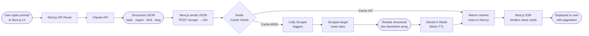

# scrape-lm

An AI-powered news aggregator. Users type a natural language prompt, which gets translated into structured JSON via the Claude API and sent to a Go/Gin backend. Colly scrapes relevant news from the web, results are cached in Redis for 30 minutes, and news is rendered as cards via Next.js SSR.

---

## Tech Stack

- **Next.js 15** — Frontend, App Router, SSR for SEO
- **Gin** — Go HTTP framework, REST API
- **Colly** — Go web scraper
- **Redis** — Caching layer (30min TTL), JWT session storage
- **NextAuth** — OAuth authentication
- **Claude API** — Translates prompt to structured JSON
- **Tailwind CSS** — Styling
- **Docker + docker-compose** — Local dev environment

---

## Architecture



---

## Folder Structure

**Frontend**

```
frontend/
├── src/
│   ├── app/
│   │   ├── (auth)/                  # Login, register pages
│   │   ├── (main)/                  # Protected pages (news feed)
│   │   ├── api/
│   │   │   ├── auth/[...nextauth]/  # NextAuth catch-all route
│   │   │   └── scrape/              # Calls Claude + forwards to Gin
│   │   ├── layout.tsx
│   │   └── globals.css
│   ├── components/
│   │   ├── ui/                      # Generic primitives (Button, Card, Spinner)
│   │   └── features/                # Domain components (NewsCard, SearchBar, Pagination)
│   ├── lib/
│   │   ├── claude.ts                # Claude API client
│   │   └── api.ts                   # Gin backend HTTP client
│   ├── hooks/                       # Custom React hooks
│   └── context/                     # Auth, Theme context providers
├── public/
│   └── robots.txt
├── middleware.ts                    # Route protection
└── next.config.ts
```

**Backend**

```
backend/
├── cmd/
│   └── main.go                      # Entry point
├── internal/
│   ├── news/
│   │   ├── handler.go
│   │   ├── service.go
│   │   ├── model.go
│   │   └── routes.go
│   ├── auth/
│   │   ├── handler.go
│   │   ├── service.go
│   │   └── routes.go
│   ├── scraper/
│   │   ├── scraper.go
│   │   ├── parser.go
│   │   ├── sources.go
│   │   └── limiter.go
│   ├── cache/
│   │   ├── redis.go
│   │   └── session.go
│   └── middleware/
│       ├── auth.go
│       ├── cors.go
│       ├── ratelimit.go
│       └── logger.go
├── pkg/
│   ├── hash/
│   └── response/
├── config/
│   └── config.go
├── Dockerfile
├── docker-compose.yml
├── Makefile
├── .env
└── .env.example
```

---

## Data Flow

1. User submits a natural language prompt in the Next.js UI
2. Next.js API route forwards the prompt to the Claude API
3. Claude returns structured JSON: `topic`, `region`, `limit`, `lang`
4. Next.js sends the JSON as `POST /scrape` to the Gin backend
5. Gin middleware validates the JWT session token
6. News service hashes the JSON to produce a deterministic cache key and checks Redis
7. On cache hit, cached `NewsItem[]` is returned immediately
8. On cache miss, Colly scrapes and parses target news sites
9. Results are stored in Redis with a 30-minute TTL, then returned
10. Next.js SSR renders the news cards and delivers them with pagination

---

## Design Decisions

- **Redis over a database** — News is ephemeral; TTL-based expiry requires no background cleanup, and read latency is sub-millisecond
- **Gin** — Lowest overhead among Go HTTP frameworks with a mature middleware ecosystem
- **Next.js SSR** — Ensures fully-rendered HTML on first request so news content is crawlable by search engines
- **Colly** — De-facto Go scraping library with built-in concurrency controls and rate limiting
- **Feature-based Go structure** — Groups all logic for a domain together, making it easier to change one feature without touching unrelated layers
- **Cache key = hash of structured JSON** — Two different prompts with the same intent share one cache entry, maximising hit rate
- **Dockerfile at root** — Avoids custom `--file` flags in every build command and CI step

---

## Getting Started

> Work in progress, setup instructions will be added once the project is ready.
